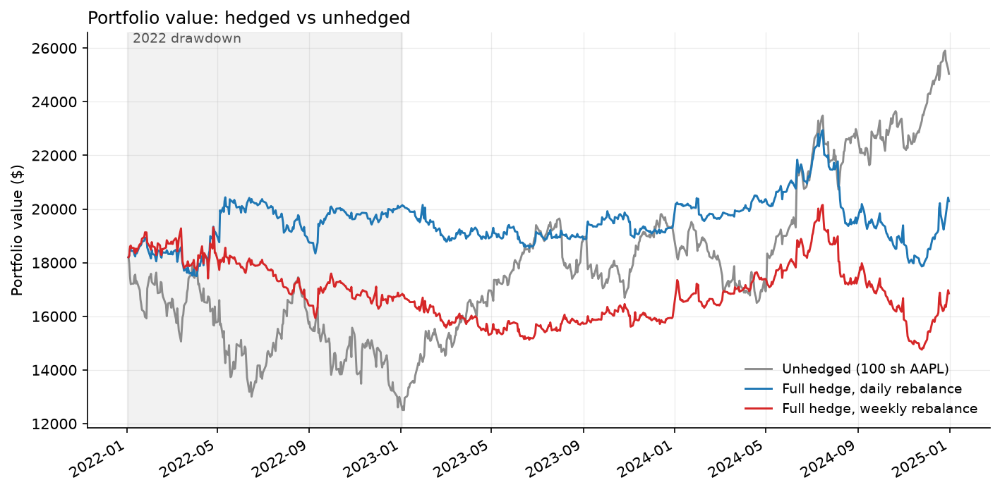

# Delta hedging backtest: AAPL, 2022-2024

## What this is

An exploratory project rather than a finished strategy. I wanted to understand
delta hedging properly, so I built one from the pricing formula upward and ran
it over three years of real Apple prices to see what it actually costs.

What I found along the way is that hedging a stock position with out-of-the-money
puts is harder than the textbook version suggests, and most of what I learned
came out of the part which broke rather than the part which worked.

I picked the time window to be 2022 (a ~31% drawdown) and 2023-24 (a ~98%
recovery), which means a hedge pays in one regime and drags badly in the other.
Either regime on its own would have decided the answer before I started.

## How it was built

I wrote the finance, being the Black-Scholes pricer and the Greeks in
[`src/black_scholes.py`](src/black_scholes.py), the hedge sizing in
[`src/hedging.py`](src/hedging.py), and the rebalancing loop in
[`src/backtest.py`](src/backtest.py). I wanted to work through these and
develop some understanding of how they work. The data loading, plotting and test scaffolding were built with Claude Code.

## What I built

The prices, implied volatility and interest rates are all real, pulled from
yfinance and FRED. The options themselves are generated with Black-Scholes at
90 days to expiry and 5% out of the money, rolled before they get close to
expiring. Pricing off VXAPL rather than a volatility I picked myself is the
thing which keeps this honest, b/c had I chosen that number the backtest would
only confirm whatever I assumed going in.

Three configurations run through the same loop, all starting at the same
portfolio value so the curves can be read against each other directly.

- `unhedged`: 100 shares and no options, as a baseline
- `hedged_daily`: net delta driven to zero, rebalanced every trading day
- `hedged_weekly`: the same target, rebalanced every fifth trading day

Every parameter choice and the reasoning behind it is in
[DECISIONS.md](DECISIONS.md).

## Where it went sideways

The first version had no floor on the hedge ratio and it blew up. Sizing to
zero net delta means holding `-shares / (contract_size * delta)` contracts, and
a 5% out-of-the-money put loses delta as the stock rallies away from the
strike. On 2024-12-06 the loop bought 440 contracts against 100 shares, which
is a long-volatility bet rather than a hedge.

I capped the delta used for sizing at 0.10, which holds the position to 10
contracts. That fixes the blowup and creates a different problem, b/c the
portfolio is then not delta-neutral on ~27% of days and its net delta reaches
97.7, meaning very close to unhedged.

That is the real lesson of the project. You cannot hold a stock position
delta-neutral using far out-of-the-money puts, since the instrument runs out of
delta exactly when you need more of it. What I shipped is a hedge which
approximates delta-neutrality most of the time and gives up on it the rest.

## What I found

| | Full window | 2022 drawdown | 2023-24 recovery | Max drawdown |
|---|---|---|---|---|
| Unhedged | +37.6% | -31.3% | +98.2% | -31.3% |
| Hedged, daily | +11.5% | +10.7% | +0.9% | -22.1% |
| Hedged, weekly | -7.4% | -7.5% | +0.5% | -26.8% |



Hedging worked and it was expensive. The protection cut the worst drawdown by
roughly a third, which is exactly what it is there for, and then gave up most
of the recovery which followed.

Weekly rebalancing cost more than daily, $10,330 against $6,524, on roughly a
quarter of the trades. Rebalancing less often means a worse average entry price
on every adjustment, and that outweighs whatever is saved by trading less. That
gap is the discrete hedging error, which is the thing I built this to measure.

The 2022 gain was not what I first assumed. My first explanation was gamma
scalping, and the attribution said otherwise. Realized volatility came in at
35.7% against 36.5% implied, so gamma actually lost money over the year, and
most of the gain came from vega instead, meaning I was holding puts while
implied volatility spiked from ~31% to ~45%. The position behaved more like a
long-volatility bet than a delta hedge, which is a conclusion I would not have
reached had I written the number up without checking it.

## What I would do differently

The fix for the blowup is to stop sizing the option leg off delta at all. Hold
the puts in a fixed ratio, one contract per 100 shares, and neutralise delta by
trading the underlying instead. A share has a delta of exactly 1 by definition,
so nothing in that calculation divides by a number approaching zero and no
floor is needed. That is how a desk would actually do it, and it is the obvious
next build.

Beyond that, I would want a static protective put as a control. It uses the
same strikes and the same roll schedule but never resizes, so the difference
between its cost and the dynamic hedge's cost isolates what the rebalancing
discipline is worth on its own. I have rough versions of both sitting on a
branch and neither is finished enough to include here.

The other gaps are Sharpe and turnover, which are not computed yet, and pricing
each strike off its own implied volatility rather than one at-the-money number.

## Limitations

Option prices are synthetic, with no volatility smile and no term structure,
since VXAPL is a 30-day measure applied to 90-day contracts. Exercise is
European on a stock whose listed options are American, which is a small error
for a put held to a roll but not a zero one. There are no bid-ask spreads,
commissions or slippage, no dividend yield in the pricer, and contracts are
fractional, all of which mean the drag reported above is a floor rather than a
realistic figure.

## Running it

```bash
python -m venv .venv && .venv/bin/pip install -r requirements.txt
.venv/bin/python -m src.data        # fetch and cache the inputs
.venv/bin/python -m src.backtest    # run all three configs, write CSVs and figures
.venv/bin/python -m pytest -m "not network"
```
